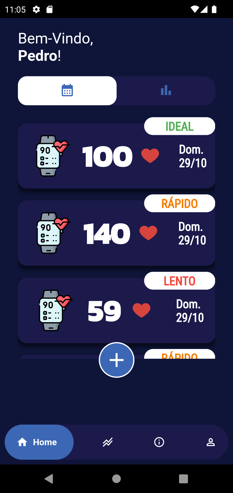
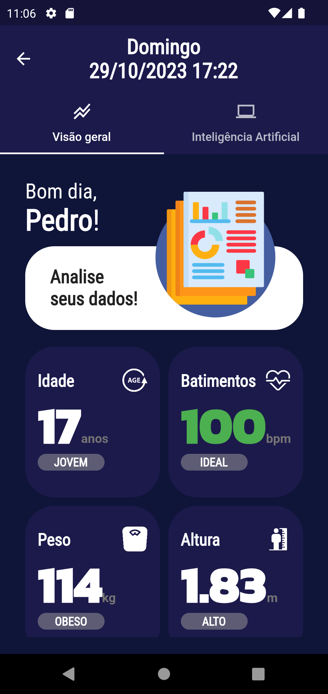
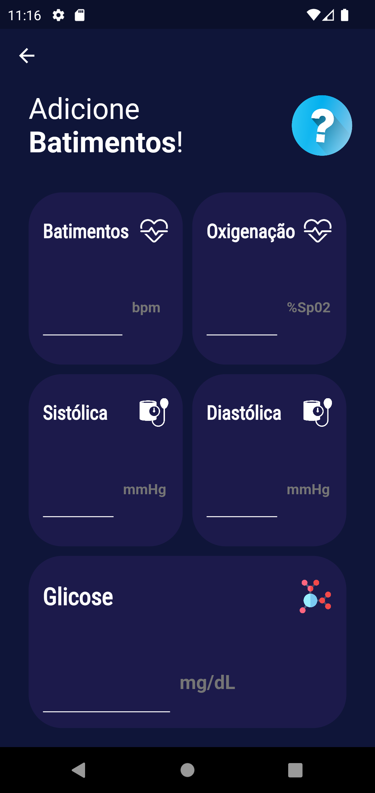
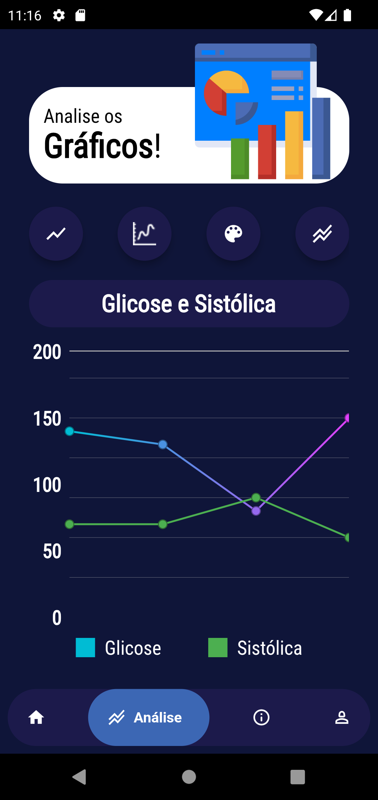
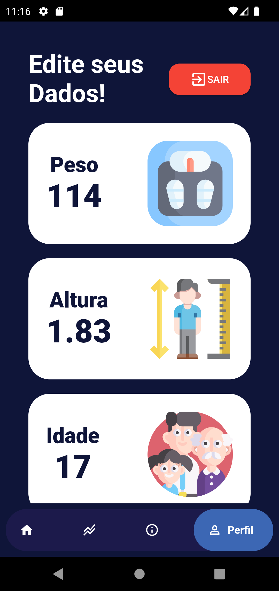
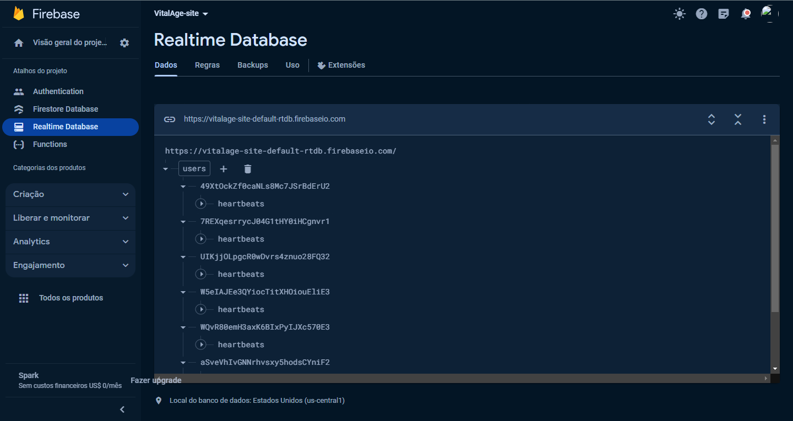
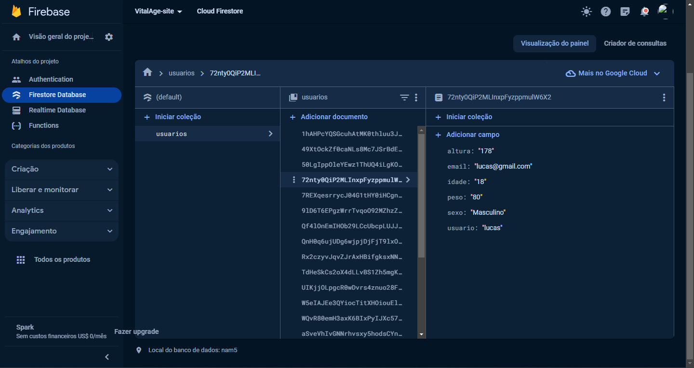

# Vital Age

# Aplicativo de Monitoramento de Batimentos Cardíacos

## Visão Geral do Projeto

O aplicativo de Monitoramento de Batimentos Cardíacos é um aplicativo mobile desenvolvido em Flutter que permite aos usuários monitorarem seus batimentos cardíacos e salvar essas informações para referência futura. O aplicativo oferece uma interface simples e intuitiva para facilitar o uso por usuários de todas as idades.

## Funcionalidades Principais

- **Monitoramento de Batimentos**: Os usuários poderão medir seus batimentos cardíacos usando o sensor de frequência cardíaca presente em seus dispositivos móveis ou através de um dispositivo externo compatível.

- **Histórico de Batimentos**: O aplicativo armazenará os batimentos cardíacos medidos anteriormente e exibirá um histórico ordenado por data e hora. Isso permitirá que os usuários acompanhem as mudanças nos seus batimentos ao longo do tempo.

- **Notificações de Frequência Cardíaca**: Os usuários podem configurar limites de frequência cardíaca e receber notificações quando a frequência cardíaca estiver acima ou abaixo desses limites. Isso pode ser especialmente útil para indivíduos que precisam monitorar sua saúde de forma mais regular.

## Telas Principais

  

  
  

.

  

  
  

## Protegendo seus dados
O aplicativo oferece uma experiência moderna e segura, integrando serviços essenciais do Firebase para fornecer uma plataforma robusta e confiável. Com ênfase na personalização e segurança, cada usuário tem a sua própria conta, garantindo uma experiência individualizada e exclusiva.

O sistema de autenticação do Firebase é implementado para garantir que apenas usuários autorizados tenham acesso ao aplicativo. Isso não apenas protege os dados sensíveis, mas também permite que cada usuário tenha seu espaço isolado e personalizado dentro do aplicativo.

Para o armazenamento de dados, o Firebase Firestore é utilizado, proporcionando um banco de dados NoSQL em tempo real. Isso significa que as informações são atualizadas em tempo real conforme são modificadas, oferecendo uma experiência dinâmica e sempre atualizada para os usuários.

Além disso, a integração com o Firebase Realtime Database possibilita a sincronização instantânea de dados entre diferentes dispositivos, garantindo consistência e acessibilidade em qualquer lugar e a qualquer momento.

Em resumo, o aplicativo oferece uma experiência completa, onde cada usuário tem sua própria conta protegida por autenticação, além de aproveitar as vantagens do Firestore e Realtime Database para proporcionar dados em tempo real, criando assim um ambiente personalizado e dinâmico para os usuários.

## Firebase

## Requisitos de Sistema

- Dispositivo móvel (smartphone ou tablet) com sistema operacional Android ou iOS.

# VitalAge
